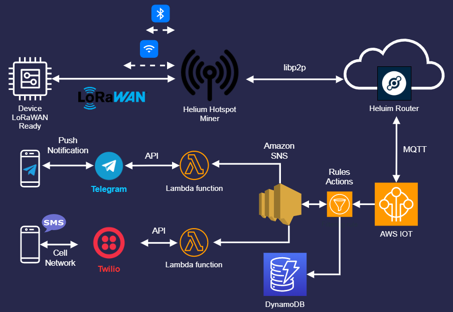
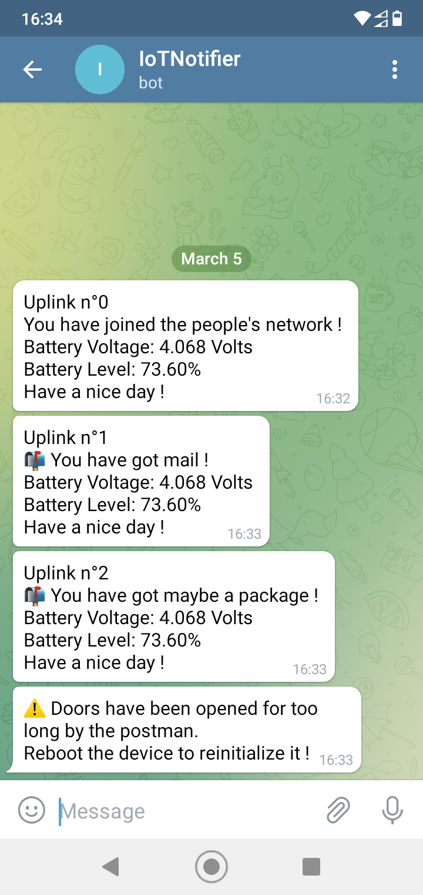
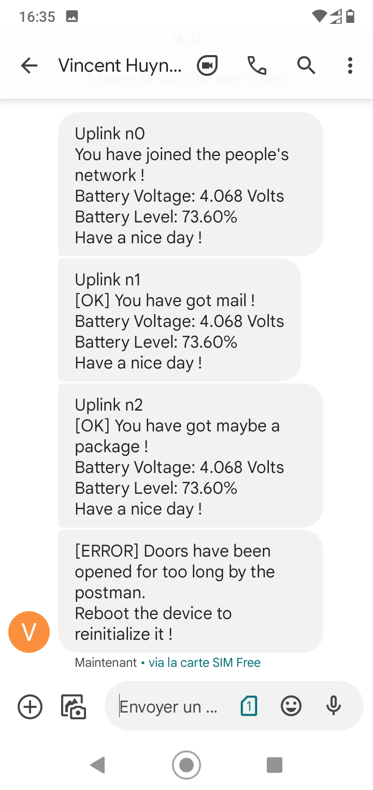
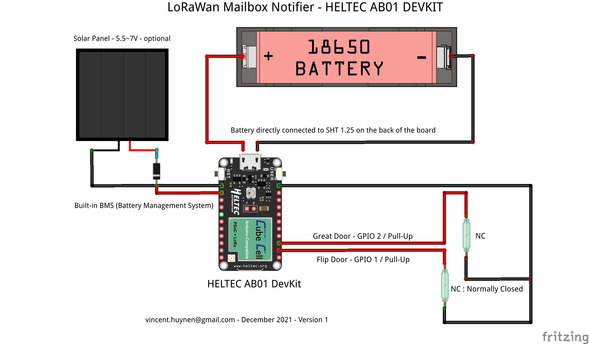

# HelTec-Cube-LoRaWAN-Helium-Mailbox-Notifier
The Mailbox Notifier is an IoT DIY project which notifies you each time you received a package or a letter in your letterbox. This is the same projet as the [ESP32-CAM-Mailbox-Notifier](https://github.com/vhuynen/ESP32-CAM-Mailbox-Notifier) one, but designed for long range distance.

This project uses an **HelTec AB01** LoRaWAN module to send data over an LoRaWAN Gateway when WiFi is out of range. I use an [Helium Gateway](https://www.helium.com/) from the **People's Network** in order to forward packets over Helium Network which sends data to [AWS IoT Core](https://aws.amazon.com/iot-core/) (MQTT) or [Pipedream](https://pipedream.com/) (HTTP) etc... LoRaWAN is a bidirectional protocol useful when you need to send few data over long distance (several miles) from low-power and low-bandwidth IoT.

The compromise over this kind of system is that you can't send heavy payload as you are able to do over WiFi. Finally the data must be treated over third-part system.

## Table of Contents


<!-- TOC -->

- [HelTec-Cube-LoRaWAN-Helium-Mailbox-Notifier](#heltec-cube-lorawan-helium-mailbox-notifier)
    - [Table of Contents](#table-of-contents)
    - [Architecture Schema](#architecture-schema)
    - [Helium Organization](#helium-organization)
        - [Registering the device in the blockchain](#registering-the-device-in-the-blockchain)
        - [Setting the AWS IoT Core Integration](#setting-the-aws-iot-core-integration)
        - [Decoder Function](#decoder-function)
        - [Flows](#flows)
    - [Telegram API](#telegram-api)
    - [Amazon Web Services](#amazon-web-services)
        - [AWS IoT Core](#aws-iot-core)
        - [Telegram Lambda Function](#telegram-lambda-function)
        - [Twilio Lambda Function](#twilio-lambda-function)
        - [Amazon SNS - Service Notification Service](#amazon-snsservice-notification-service)
        - [Rules](#rules)
    - [Heltec AB01](#heltec-ab01)
        - [Prerequisite](#prerequisite)
        - [Data Format](#data-format)
        - [First Byte values](#first-byte-values)
        - [Second and Third Byte](#second-and-third-byte)
        - [Power up](#power-up)
        - [Fetch mail](#fetch-mail)
        - [You have got mail](#you-have-got-mail)
        - [Power-Saving](#power-saving)
    - [Notifications in action](#notifications-in-action)
    - [Electic Schema](#electic-schema)

<!-- /TOC -->

## Architecture Schema



## Helium Organization


Before going further, you should verify that you are within the coverage of the [Helium Network](https://explorer.helium.com/). Your device should be at the proximity of a least one gateway (350 meters). If not, this allows you to expand the network with your own gateway. After that, you will have to create an account on the [Helium Console](https://console.helium.com/).

### Registering the device in the blockchain

You must register your [device](https://docs.helium.com/use-the-network/console/adding-devices) in the blockchain. This operation can take a while (20 mins) before your device can join the network.
The registration generates three important values that you will have to report in the device's program later.
- **Device EUI** :
  - The DevEUI is a 64-bit globally-unique Extended Unique Identifier (EUI-64) generated throught the Helium Console. This identifier is mandatory because the Helium router has an XOR filter that filters packets from devices it knows only.
- **App EUI** :
  - the AppEUI is an application identifier, and this can be public without any concerns
- **App Key** :
  - The App Key is an AES-128 secret key that is shared between the device and your Helium Organization. This Key is used to provide end-to-end symmetric encryption of your payload data. 

### Setting the AWS IoT Core Integration

Helium Console offers more than fifteen integrations and the list is constantly growing. 
As expected in the architecture the payload data is forwarded to your AWS Organization. [You will have to connect your Helium Organization to your AWS Organization](https://docs.helium.com/use-the-network/console/integrations/aws-iot-core/).
In my case, the Uplink messages from Helium are published into a Topic named **topic/gateway**

### Decoder Function

[Function Decoder](https://docs.helium.com/use-the-network/console/functions/) is a JavaScript function that allows you to decode the byte payload into a readable JSON Format. The decoded payload is added to the main JSON payload that is forwarded to your Integration target. The payload will be entirely formatted into a [specific function](https://github.com/vhuynen/HelTec-AB01-LoRaWAN-Helium-Mailbox-Notifier/blob/main/source/decoder/MailboxNotifierDecoder.js) that transcodes the mailbox's state (which is hexadecimal) into a readable message enriched by the battery voltage and battery level.

```js
function Decoder(bytes, port, uplink_info) {

  //decode message type form payload
  var data = bytes[0];
  //output decoded message depending on the data
  switch (data) {
    case 0x03:
      return {
msg: "Uplink n°" + uplink_info.fcnt + "\nYou have got mail !\nBattery Voltage: " + ((bytes[1]  << 8 ) + bytes[2])  /  1000  + " Volts\nBattery Level: " + ((((((bytes[1]  << 8 ) + bytes[2])  /  1000) - 3.7) / (4.2 - 3.7)) * 100).toPrecision(4) + "%\nHave a nice day !",
      };
    case 0x02:
      return {
msg: "Uplink n°" + uplink_info.fcnt + "\nYou have got maybe a parcel !\nBattery Voltage: " + ((bytes[1]  << 8 ) + bytes[2])  /  1000  + " Volts\nBattery Level: " + ((((((bytes[1]  << 8 ) + bytes[2])  /  1000) - 3.7) / (4.2 - 3.7)) * 100).toPrecision(4) + "%\nHave a nice day !",
      };
    case 0x04:
      return {
msg: "\n[ERROR] Doors have been opened for too long since you have powered the device on. Reboot the device to reinitialize it !",
      };
    case 0x05:
      return {
msg: "\n[ERROR] Doors have been opened for too long since you have fetched your mail. Reboot the device to re-initialize it !",
      };
    case 0x06:
      return {
msg: "\n[ERROR] Doors have been opened for too long by the postman. Reboot the device to reinitialize it !",
      };
    case 0x01:
      return {
msg: "Uplink n°" + uplink_info.fcnt + "\nYou have joined the people's network !\nBattery Voltage: " + ((bytes[1]  << 8 ) + bytes[2])  /  1000  + " Volts\nBattery Level: " + ((((((bytes[1]  << 8 ) + bytes[2])  /  1000) - 3.7) / (4.2 - 3.7)) * 100).toPrecision(4) + "%\nHave a nice day !",

      };
    default:
      return {msg: "\nunknown"};
  }
}
```

### Flows

[Flows](https://docs.helium.com/use-the-network/console/flows/) is a powerful visual-centric view that allows users to instantly understand the relationship among devices, functions, and integrations. Flows enables users to visually connect nodes and control the data flow.
Right below, the basic flow used as part of the mailbox project :


## Telegram API


First, you will have to create your bot thanks to the [BotFather](https:telegram.me/botfather). Side note: there's no need to describe how to do that, there is solid content about this topic on the Web : [send notifications to your smartphone using a Telagram bot](http://solvit.io/0f9c61a)

Keep carefully your **API Key** and your **Chat ID**, they will be required to set the AWS Lambda function later.

## Amazon Web Services


### AWS IoT Core

When a device joins the Helium Network for the first time, it's immediately attached to an **AWT IoT Core** Integration. Then the device is auto-provisionned by the API (Things, Certificat, Policy). The **name** of the ```Things``` is the same as the **ID** from the Devices Helium Console.

### Telegram Lambda Function

You now must create a Python Lambda function to send your message to your Telegram **Bot**. I have already written an article on how to do that : [Send Telegram Bot with Python and AWS Lambda](https://github.com/vhuynen/Telegram-Lambda-AWS-Python#readme).

You must declare two environment variables to set your Telegram lambda with the values previously retrieved from BotFather :
- _TELEGRAM_CHAT_ID_ : **\<Chat ID\>**
- _TELEGRAM_TOKEN_ : **bot\<API Key\>**

### Twilio Lambda Function

(Optional): As for Telegram, you will have to create a Python Lambda in order to send SMS through Twilio. You can find an exemple of a code's snippet [here](https://github.com/vhuynen/Telegram-Lambda-AWS-Python#other-snippet).

### Amazon SNS - Service Notification Service

The SNS is a Topic that once it receives any message, transfers it to all subscribers. In my case, the SNS calls both the Telegram Lambda endpoint as well as the Twilio Lambda endpoint. Now, create an SNS and connect the subscription's endpoints (Lambda) to it as well as policies in order to enable the SNS to call the Lambda functions.

### Rules

In order to treat the data from your device to AWS IoT Core, you must create a **Rules** that identifies your device thanks to a **filter**.
In my case, the filter selects the decoded message received from Helium and retreived from the **MQTT Topic** ```'topic/gateway'```. Finally, I applied the filter only on my **dev_eui** device.

Below, my [AWS IoT SQL](https://docs.aws.amazon.com/iot/latest/developerguide/iot-sql-reference.html) request:

``` sql
SELECT VALUE decoded.payload.msg FROM 'topic/gateway' where dev_eui = '6078F99C6925AD54'
```

To finish, select the SNS Push Notification previously created, choose the message format **RAW** and apply an IAM roles to grant the IoT Core to access it.

Below, the hierarchical view of the AWS components involved:

```
AWS IoT Core
     └── Rules
           └── SNS Topic
                  ├── Telegram Lambda
                  └── Twilio Lambda
```

## Heltec AB01


### Prerequisite

### Data Format

### First Byte values

### Second and Third Byte

### Power up

### Fetch mail

### You have got mail

### Power-Saving

## Notifications in action


|Telegram Notification|SMS Twilio Notification|
|:--------------:|:-----------------:|
|||

## Electic Schema


